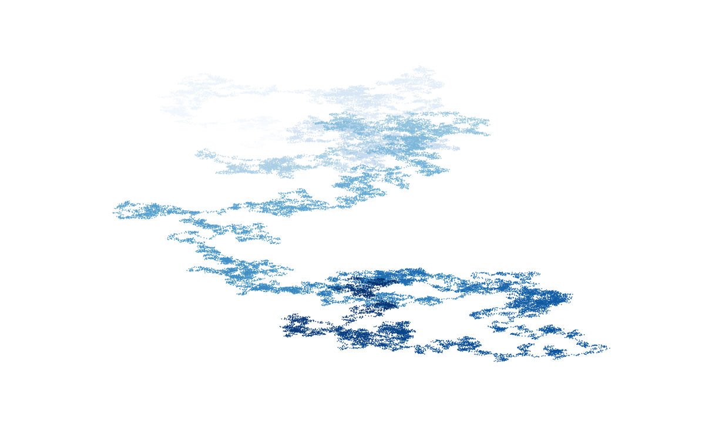

# Random Walk

This project visualizes a random walk using Python.  
A random walk is a mathematical process that shows a path made of random steps.  
The goal of this project is to practice Python basics, lists, and data visualization using Matplotlib.


## Project Features
- Generates random walk data
- Visualizes the path using a scatter plot
- Hides axes for a clean visualization

## Technologies Used
- Python
- Matplotlib
- Random module

## How to run program
1. Install the Matplotlib module if not installed.
    ```bash
    pip install matplotlib
2. Run the file.
    ```bash
    python plot.py

## Web
- To run the project on web run "web.py" file.
    ```bash
    python web.py

## Output
The program displays a plot showing a random path created by step-by-step movement in random directions.



## Learning Outcome
- Understand how random walks work
- Practice Python list operations
- Learn basic data visualization with Matplotlib